# Teaching-HEIGVD-RES-2021-Labo-HTTPInfra
###### Alessando Parrino & Dylan Canton

###### 30.05.2021

---

## Table of contents

- [Step 1: Static HTTP server with apache httpd](#step-1-static-http-server-with-apache-httpd)
- [Step 2: Dynamic HTTP server with express.js](#step-2-dynamic-http-server-with-expressjs)
- [Step 3: Reverse proxy with apache (static configuration)](#step-3-reverse-proxy-with-apache-static-configuration)
- [Step 4: AJAX requests with JQuery](#step-4-ajax-requests-with-jquery)
- [Step 5: Dynamic reverse proxy configuration](#step-5-dynamic-reverse-proxy-configuration)

### Bonus Steps

- [Extra step: Load balancing - multiple server nodes](#extra-step-load-balancing---multiple-server-nodes)
- [Extra step: Load balancing - Round-robin vs Sticky sessions](#extra-step-load-balancing---round-robin-vs-sticky-sessions)
- [Extra step: Management UI](#extra-step-management-ui)

### Step 1: Static HTTP server with apache httpd

#### Purpose

This step allows you to set up an apache httpd server in a docker. A web template is also set up in order to have a coherent and clean rendering.

#### Implementation

First of all we download the apache server docker image on *dockerhub*. It was chosen here to take an image taking into account a PHP server, in order to increase the scalability over time and the possibilities offered. The chosen image is therefore the official image of PHP with apache HTTPD server at this address: https://hub.docker.com/_/php/

We then create a dockerfile containing the following lines:

```
FROM php:7.2-apache

COPY content/ /var/www/html/
```

- `FROM php:7.2-apache` : This first line allows to recover the image of PHP with apache server in version 7.2.
- `COPY content/ /var/www/html/` : Finally, we copy the contents of the local `content` folder into our docker at the location `/var/www/html`. This folder will contain our static website to launch in the docker container.

To provide us with a theme for the static website, there is a wide variety of sites offering free templates. We chose to take one from this site: https://www.free-css.com/free-css-templates and modify it to keep only the essential, a home page.

The files of this web template are therefore put in our local `content `folder so that they are copied into the docker when the container is launched.

Then we create 2 scripts for the build of the image and the launch in order to facilitate the use of docker. The first script `build-image.sh` allows to build the image

```
#!/bin/bash

# Build the Docker image
docker build --tag res/apache_php .
```

The second script `run-container.sh` allows you to launch the container, note here that the option `-p 9090: 80` allows you to do a port mapping. We redirect port **9090** of our local machine to port **80** of the docker in order to access the apache server on our browser (port 80 being provided for the HTTP protocol).

```
#!/bin/bash

# Run docker image and do port mapping
docker run -p 9090:80 res/apache_php
```

#### Tests

The `content` folder, the *Dockerfile* and the 2 scripts for building and launching the image are put in a single folder.

Then we build the image by running the `build.image.sh` script

```
./build-image.sh
```

And we launch the docker with the second script `run-container.sh`

```
./run-container.sh
```

The docker is now running, we try to access our static website from our local machine by typing the address `localhost: 9090` in our browser. We can see here that the site is accessible and displays the template that we have set up :

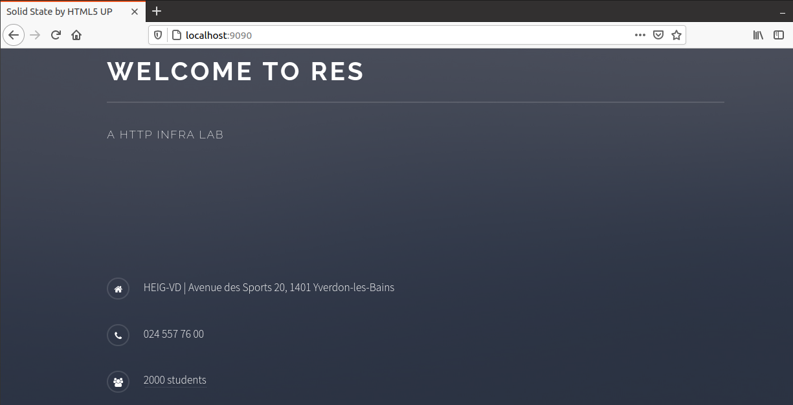


---

### Step 2: Dynamic HTTP server with express.js

#### Purpose

In this second part of the lab we were asked to create a node.js project, node is used in combination with the package express to be able to create easily an http server, everything will then be integrated into a docker container.


#### Implementation

The server is run on the localhost address of the machine running the index.js file, the server listens on port 3000. Our server uses the express packages for the http server and the chance package to create a list of animals returned in the form of a JSON string.The server can be stopped with the command ctrl-c. We then create a dockerfile containing the following lines:

```dockerfile
FROM node:14.16.1

COPY src /opt/app

CMD ["node", "/opt/app/index.js"]
```

- `FROM node:14.16.1` : This first line allows to recover the image of node.js.
- `COPY src /opt/app` : Finally, we copy the contents of the local `src` folder into our docker at the location `/opt/app`. This folder will contain our project node.js.
- `CMD ["node", "/opt/app/index.js"]` : indicate the command to be executed when launching the container.

Exemple of our JSON result: `{"Name":"Jackal","Age":33,"Gender":"Male"}`


#### Tests

In the `docker-images/express-image` folder you will find everything necessary for the installation of our node server. We need to build our docker image, I have already configured for you a bash file **build-image.sh** with the command: `docker build -t res/express_student .` , doing so will run the configurations found in the DockerFile. Then you need to run the newly created container with the command :`docker run -p 'yourPort':3000 res/express_student` (or use the file **run-container.sh** which uses the port-mapping -p 9090:3000). Finally you can retrieve the json files at `localhost:'portUsedBefore'`, through a browser, postman, telnet (or whatever you prefer ( ͡° ͜ʖ ͡°) ).


#### Result using Postman

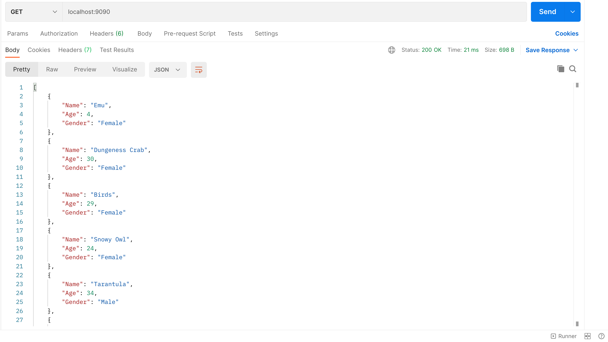


---

### Step 3: Reverse proxy with apache (static configuration)

#### Purpose

In this third part of the lab we were asked to configure a reverse proxy so that we can specify which resource we want to access.


#### Implementation

We create a Dockerfile containing the following lines:

```dockerfile
FROM php:7.2-apache 

COPY conf/ /etc/apache2

RUN a2enmod proxy proxy_http
RUN a2ensite 000-* 001-*
```

- `RUN a2enmod proxy proxy_http` activate proxy and proxy-http modules

- `RUN a2ensite 000-* 001-*` allows to activate files starting with "000-..." and "001-...".

In the `conf/` folder we will find the configuration files of our reverse proxy, this folder will be copied in the directory `/etc/apache2` of our container.

The configuration of our reserve proxy can be found in the file `001-reverse-proxy.conf`

  ```php
  <VirtualHost *:80>
      ServerName demo.res.ch
      
      ProxyPass "/api/animals/" "http://172.17.0.3:3000/"
      ProxyPassReverse "/api/animals/" "http://172.17.0.3:3000/"
  
      ProxyPass "/" "http://172.17.0.2:80/"
      ProxyPassReverse "/" "http://172.17.0.2:80/"
      
  </VirtualHost>
  ```

  The server runs at the address **demo.res.ch** at port **80**, you will need to configure the local dns of your machine, on Unix systems you will just add this line `127.0.0.1 demo.res.ch` to the file `~/etc/hosts`.

  Next we find the routes to our two containers, we have determined that:

  - The node.js server for the animal list will need to run at address **172.17.0.3 :3000**

  - The apache server that hosts our site should run at the address **172.17.0.2 :80**

    **Please note:** you will need to run the apache server first and then the node server, you will also need to make sure that the addresses assigned by docker are the same, to do this we can check with the command `docker inspect "containerName" | grep -I ipaddress`.

  We could then access it with the paths **/api/animals/** and **/** .


#### Tests

In the `docker-images/apache-reverse-proxy` folder you will find everything necessary for the installation of our reverse proxy. We need to build our docker image, I have already configured for you a bash file **build-image.sh** with the command: `docker build -t res/apache_rp .` , doing so will run the configurations found in the DockerFile. Then you will need to run the containers in the following order:

```sh
docker run -d res/apache_php
docker run -d res/express_student
docker run -d -p 8080:80 res/apache_rp
```

I have already configured for you a bash file **run-multi-containers.sh** with the commands above.

Finally you can retrieve our website at `demo.res.ch:8080` and our json animals at `demo.res.ch:8080/api/animals`


#### Result

**Website:**

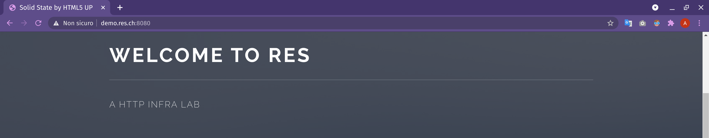

**JSON content:**

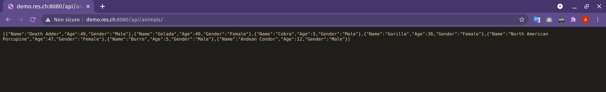


#### Infrastructure Diagram

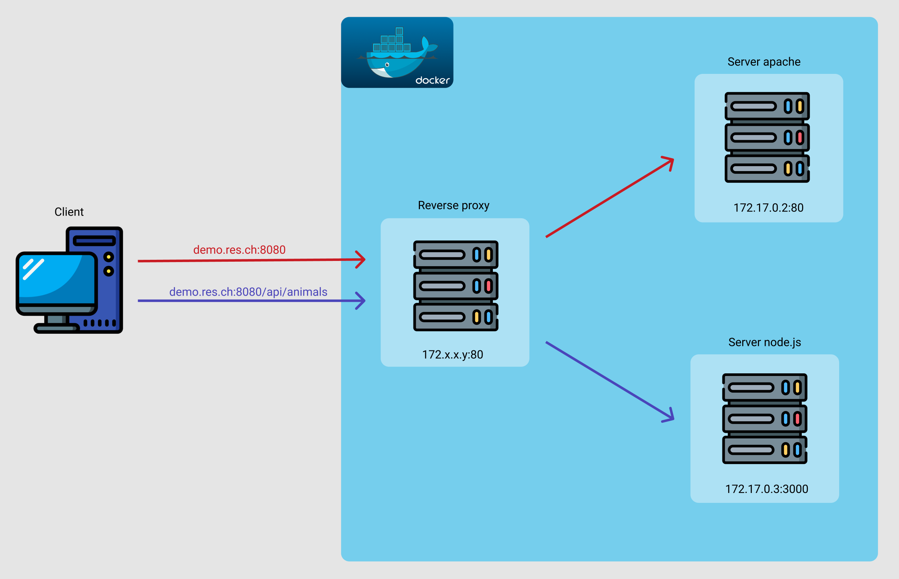


---

### Step 4: AJAX requests with JQuery

#### Purpose

In this fourth part of the workshop we were asked to make the content of our web page dynamic.


#### Implementation

In this step we added to the Dockerfiles:

```sh
RUN apt-get update && \
    apt-get install -y vim
```

These two lines allow us to install the [Vim](https://www.vim.org/) text editor every time we create a new container, in this way we could edit the files inside the containers.

We have created a Javascript file "animals.js" in `docker-images/apache-php-image/content/js`:

```javascript
$(function(){
    function loadAnimals(){
            $.getJSON("/api/animals/", function(animals){
                    var message = "Nobody is here"; 
                    if(animals.length > 0){
                            message = animals[0].Name;
                    }
                    $(".skills").text(message);
            });
    };
    loadAnimals();
    setInterval(loadAnimals, 2000);
});
```

This function will be executed when the JQuery library is loaded because is called used the variable $, it sends an Ajax request to fetch the JSON data provided by our node.js server which provides a list of animals in JSON format. It will then take the name of the first animal in the list and insert it inside the HTML tag that contains the **class="skills"**. The function will be repeated every 2 seconds.

Then we integrated it with what we did in the previous step by adding scripts to the initial page **index.html**

```html
<script src="https://code.jquery.com/jquery-3.6.0.js"></script>
<script src="js/animals.js"></script>
```

- The first line allows us to library [JQuery](https://jquery.com/)
- The second allows us to include the previously created animals.js file.

Once this is done we have obtained our dynamic site that we can find at the address **demo.res.ch:8080**


#### Tests

In this phase it will be necessary to rebuild the `res/apache_php` image in order to make the modifications made using `docker-images/apache-php-image/build-image.sh`. Go in the `docker-images/apache-reverse-proxy` folder you will find everything necessary for launch our dynamic website. Then you will need to run the containers in the following order:

```dockerfile
docker run -d res/apache_php
docker run -d res/express_student
docker run -d -p 8080:80 res/apache_rp
```

I have already configured for you a bash file **run-multi-containers.sh** with the commands above.

Finally you can retrieve our dynamic website at `demo.res.ch:8080` and our JSON animals at `demo.res.ch:8080/api/animals`


#### Result

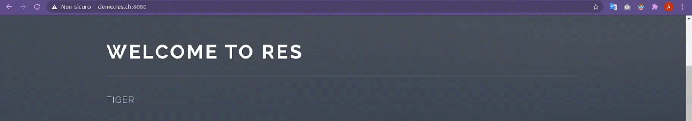


---

### Step 5: Dynamic reverse proxy configuration

#### Purpose

The reverse proxy currently in place uses fixed IP addresses. The goal is to make the management of these addresses dynamic to adapt to the change of container addresses by passing the addresses via the `-e` flag of the` docker run` command and by executing a custom script in order to retrieve the environment variables to generate a configuration file. 


#### Implementation

First of all we create an `apache2-foreground` file in the same folder as the ` Dockerfile`. Its content is taken from the official PHP docker git : https://github.com/docker-library/php/blob/master/apache2-foreground 

We add the following lines in order to display the environment variables passed as a parameter of the `docker run` command with the` -e` flag. 

```sh
# Add setup for RES lab
echo "Setup for the RES lab..."
echo "Static App URL: $STATIC_APP"
echo "Dynamic App URL: $DYNAMIC_APP"
```

We add this line too in order to allows to copy the configuration file generated in PHP into the container. 

```sh
# Copy the ip addresses of the static and express dynamic servers
php /var/apache2/templates/config-template.php > /etc/apache2/sites-available/001-reverse-proxy.conf
```

To be sure that the script is executable on the *reverse-proxy server*, we configure the execution rights on the script : 

```shell
chmod 755 apache2-foreground
```


At the same level as the *Dockerfile*, we create a `templates` folder and inside a PHP file ` config-template.php`. This file will allow to retrieve the environment variables passed as parameters during the `docker run` command and to insert them in the configuration of the reverse proxy. It is this configuration that will be copied into the container using the `apache2-foreground` script that we created just before. 

```php
<?php
	$dynamic_app = getenv('DYNAMIC_APP');
	$static_app  = getenv('STATIC_APP');
?>

<VirtualHost *:80>
    ServerName demo.res.ch
	
    ProxyPass '/api/animals/' 'http://<?php print "$dynamic_app"?>/'
    ProxyPassReverse '/api/animals/' 'http://<?php print "$dynamic_app"?>/'

    ProxyPass '/' 'http://<?php print "$static_app"?>/'
    ProxyPassReverse '/' '<?php print "$static_app"?>/'
</VirtualHost>
```


It remains to modify the *Dockerfile* to integrate our new files into the container during the _run_ of the image: 

* We copy the script `apache2-foreground` in the ` /usr/local/bin` folder of the container. 
* We copy the `templates` folder containing the PHP file ` config-template.php` in the `/var/apache2/templates` folder of the container.

> **Warning**: It is important to note that the `apache2-foreground` script must be in UNIX format to run correctly on Linux. The problem is that using it on Windows will cause formatting problems and make the script potentially non-executable. It is possible to resolve this problem manually by rewriting or copying the script into a new file once in Windows. 
>
> However, we have chosen to perform this formatting automatically using the _dos2unix_ tool which allows it to be done. This tool is therefore downloaded when the Dockerfile is launched and the script converted. 

```dockerfile
FROM php:7.2-apache 

RUN apt-get update && \
    apt-get install -y vim && \
    apt-get install dos2unix

# Copy apache2-foreground to container
COPY apache2-foreground /usr/local/bin

# Launch dos2unix to format script in the right way if executed on Windows
RUN cd /usr/local/bin/ && dos2unix apache2-foreground

# Copy templates folder to container
COPY templates  /var/apache2/templates

# Copy conf folder content to container
COPY conf/ /etc/apache2

# Install required modules
RUN a2enmod proxy proxy_http

# Active virtual hosts
RUN a2ensite 000-* 001-*
```


#### Tests

The goal here is to test that our reverse proxy manages IP addresses dynamically. For this, we run several static servers of the `apache_php` image and several dynamic express servers of the ` express_student` image, only a static server and a dynamic express server have a name with the `--name` flag, they are the servers we are going to use with our _reverse proxy_. 

```sh
docker run -d res/apache_php
docker run -d res/apache_php
docker run -d --name apache_static res/apache_php

docker run -d res/express_student
docker run -d res/express_student
docker run -d --name express_student res/express_student
```


Once launched, we retrieve their respective IP addresses with `docker inspect` .

```sh
docker inspect apache_static | grep -i ipaddr
docker inspect express_student | grep -i ipaddr
```


We can now run the _reverse proxy_ of the `apache_rp` image by indicating the IP addresses of our static and dynamic server with the ` -e` flag and our 2 environment variables `DYNAMIC_APP` and ` STATIC_APP`. 

In this command, the 2 addresses `x.x.x.x` and` y.y.y.y` are to be replaced by the IP addresses of our 2 servers retrieved just before. 

```sh
docker run -d -e STATIC_APP=x.x.x.x:80 -e DYNAMIC_APP=y.y.y.y:3000 --name apache_rp -p 8080:80 res/apache_rp
```


We can therefore verify that the _reverse proxy_ is indeed using our 2 servers by accessing the home page of our site at the address `http://demo.res.ch:8080/`.

The behavior of the _reverse proxy_ should be similar to the previous steps. The website is displayed and dynamic content fetched correctly. 

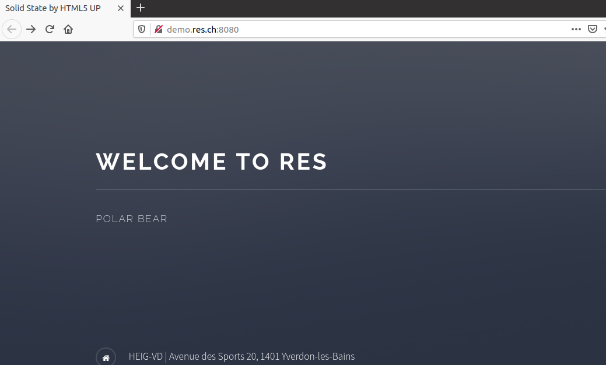


The solution described above is functional, but the recovery of the IP addresses of the containers and the launch of the _reverse proxy_ are not optimal. You have to execute these 3 commands each time, which can be redundant. We therefore decided to implement a `run-multi-containers` script which groups these actions and executes them automatically. 

The script : 

* Start a static server of the `apache_php` image and a dynamic server of the` express_student` image.
* Retrieve the IP addresses of these 2 containers with the `docker inspect` command and store them in 2 variables. 
* Run the _reverse proxy_ of the `apache_rp` image using the 2 variables above.

>**Warning**: Before running this script, make sure that no other container with the name `apache_php` or ` express_student` is present, if this is the case, it is necessary to delete them with `docker rm 'nomImage' `. 

```sh
#!/bin/bash
docker run -d --name apache_static res/apache_php
docker run -d --name express_student res/express_student

#Use to get ip address from apache static server automatically
ip_static=$(docker inspect --format='{{range .NetworkSettings.Networks}}{{println .IPAddress}}{{end}}' apache_static)

#Use to get ip address from express dynamic server automatically
ip_dynamic=$(docker inspect --format='{{range .NetworkSettings.Networks}}{{println .IPAddress}}{{end}}' express_student)

#Run reverse proxy server with ip addresses from static server and express dynamic server
docker run -d -e STATIC_APP=$ip_static:80 -e DYNAMIC_APP=$ip_dynamic:3000 --name apache_rp -p 8080:80 res/apache_rp
```


---

### Extra step: Load balancing - multiple server nodes

#### Purpose

Implementation of a load balancing system in the event of a server failure. The load is then distributed over the other servers in the cluster so that the site remains accessible. 


#### Implementation

The apache documentation provides a module for load balancing : https://httpd.apache.org/docs/2.4/mod/mod_proxy_balancer.html


Its implementation requires : 

* the `proxy module` (already installed)
* `the proxy_balancer` module 
* And a module providing the load balancing algorithm. 

In our case, we have chosen the `lbmethod_byrequests` module which is based on the number of requests 


We first add the 2 modules `proxy_balancer` and ` lbmethod_byrequests` in the Dockerfile of the _reverse proxy_.

```dockerfile
RUN a2enmod proxy proxy_http proxy_balancer lbmethod_byrequests
```


After that, we configure the load balancing clusters in the `config-template.php` file. Clusters are groupings of several servers. We are setting up 2 clusters here (between the <Proxy> tags) , one containing 2 static servers and the other 2 dynamic servers. We then modify the reverse proxy so that it calls these clusters rather than our servers directly. 

We are also adding a tool that allows the management of load balancing in the browser on the page http://demo.res.ch/balancer-manager.

```php
<Location /balancer-manager>
    SetHandler balancer-manager
</Location>
  
ProxyPass /balancer-manager !
```


```php
<?php
	$dynamic_app_1 = getenv('DYNAMIC_APP_1');
	$dynamic_app_2 = getenv('DYNAMIC_APP_2');
	$static_app_1  = getenv('STATIC_APP_1');
	$static_app_2  = getenv('STATIC_APP_2');
?>

<VirtualHost *:80>
    ServerName demo.res.ch
    
    <Location /balancer-manager>
      SetHandler balancer-manager
    </Location>
  
    ProxyPass /balancer-manager !
	
    <Proxy "balancer://dynamic_app_cluster">
    BalancerMember 'http://<?php print "$dynamic_app_1"?>'
    BalancerMember 'http://<?php print "$dynamic_app_2"?>'
    </Proxy>

    <Proxy "balancer://static_app_cluster">
    BalancerMember 'http://<?php print "$static_app_1"?>'
    BalancerMember 'http://<?php print "$static_app_2"?>'
    </Proxy>

    ProxyPass '/api/animals/' 'balancer://dynamic_app_cluster/'
    ProxyPassReverse '/api/animals/' 'balancer://dynamic_app_cluster/'

    ProxyPass '/' 'balancer://static_app_cluster/'
    ProxyPassReverse '/' 'balancer://static_app_cluster/'
</VirtualHost>
```


#### Tests

We launch 2 static servers and 2 dynamic express servers :

```sh
docker run -d --name apache_static_1 res/apache_php
docker run -d --name apache_static_2 res/apache_php
docker run -d --name express_student_1 res/express_student
docker run -d --name express_student_2 res/express_student
```


We then get the ip addresses with the `docker inspect myContainerName | grep -i ipaddr` command.


We launch the reverse proxy with the IP addresses of the 4 servers launched previously  : 

```sh
docker run -d -e STATIC_APP_1=x.x.x.x:80 -e STATIC_APP_2=x.x.x.x:80 -e DYNAMIC_APP_1=y.y.y.y:3000 -e DYNAMIC_APP_2=y.y.y.y:3000 --name apache_rp -p 8080:80 res/apache_rp
```


We make sure that the site is accessible and works correctly, we will then stop a static server and a dynamic express server to use load balancing.

```sh
docker kill apache_static_2
docker kill express_student_1
```


We check that the site is still working.

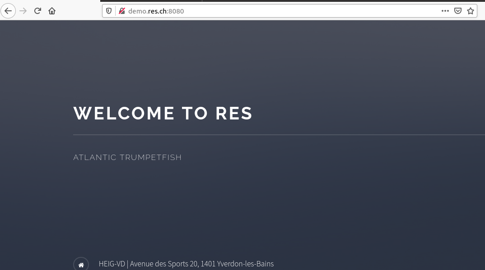


We can see the load balancing status on the page http://demo.res.ch/balancer-manager. Since 2 servers are down, load balancing has distributed the load on the other server of each cluster. 

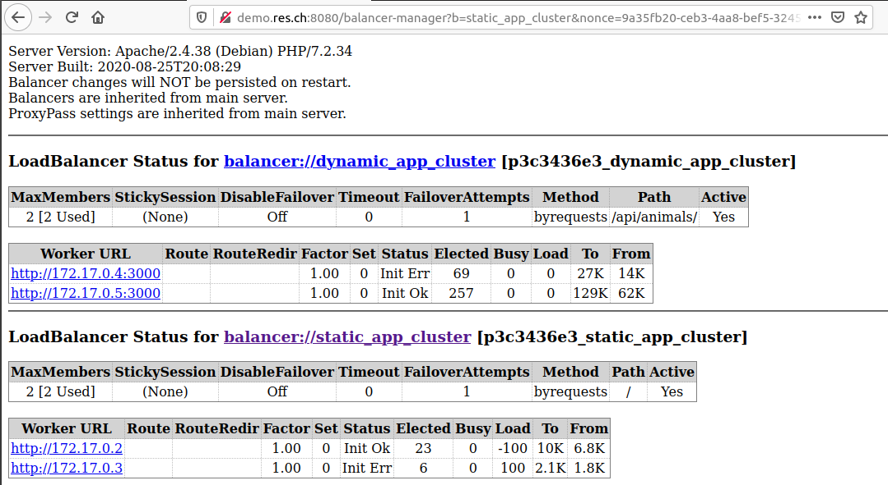


As in step 5, we want to automate the launch of the servers. We therefore create a `run-multi-containers-loadBalancing` script using the` run-multi-containers` script from step 5 as a base. 

```sh
#!/bin/bash
docker run -d --name apache_static_1 res/apache_php
docker run -d --name apache_static_2 res/apache_php
docker run -d --name express_student_1 res/express_student
docker run -d --name express_student_2 res/express_student

#Use to get ip address from apache static servers automatically
ip_static_1=$(docker inspect --format='{{range .NetworkSettings.Networks}}{{println .IPAddress}}{{end}}' apache_static_1)

ip_static_2=$(docker inspect --format='{{range .NetworkSettings.Networks}}{{println .IPAddress}}{{end}}' apache_static_2)

#Use to get ip address from express dynamic servers automatically
ip_dynamic_1=$(docker inspect --format='{{range .NetworkSettings.Networks}}{{println .IPAddress}}{{end}}' express_student_1)

ip_dynamic_2=$(docker inspect --format='{{range .NetworkSettings.Networks}}{{println .IPAddress}}{{end}}' express_student_2)

#Run reverse proxy server with ip addresses from static server and express dynamic server
docker run -d -e STATIC_APP_1=$ip_static_1:80 -e STATIC_APP_2=$ip_static_2:80 -e DYNAMIC_APP_1=$ip_dynamic_1:3000 -e DYNAMIC_APP_2=$ip_dynamic_2:3000 --name apache_rp -p 8080:80 res/apache_rp
```


---

### Extra step: Load balancing - Round-robin vs Sticky sessions

#### Purpose

The goal here is to show that the load balancer uses the _round-robin_ to distribute requests to dynamic servers as well as the implementation of _sticky sessions_ for requests to static servers. 

The _round-robin_ is a scheduling algorithm allowing to distribute the working time between the different systems. The requests sent will be distributed among the various servers available according to the scheduling algorithm. 

Setting up _sticky-sessions_ makes it possible to keep a session open for several exchanges of requests between a client and the same server. 


#### Implementation

The implementation of the _sticky sessions_ is indicated on the page concerning the load balancing_ of apache : https://httpd.apache.org/docs/2.4/mod/mod_proxy_balancer.html


The method chosen here for the _sticky sessions_ is the use of *cookies*. We add the `headers` module in the _Dockerfile_ of the reverse proxy which allows us to implement the *cookies* system. 

```
RUN a2enmod proxy proxy_http proxy_balancer lbmethod_byrequests headers
```


The `config-template.php` file is modified in order to add a cookie.

```php
Header add Set-Cookie "ROUTEID=.%{BALANCER_WORKER_ROUTE}e; path=/" env=BALANCER_ROUTE_CHANGED
```


We must also configure a route for each member of the static server cluster.

```php
BalancerMember 'http://<?php print "$dynamic_app_X"?>' route=X
```


Finally, we link the session to the cookie created previously.

```php
ProxySet stickysession=ROUTEID
```


Here is the `config-template.php` file after configuring cookies for _sticky sessions_ :

```php
<?php
	$dynamic_app_1 = getenv('DYNAMIC_APP_1');
	$dynamic_app_2 = getenv('DYNAMIC_APP_2');
	$static_app_1  = getenv('STATIC_APP_1');
	$static_app_2  = getenv('STATIC_APP_2');
?>

<VirtualHost *:80>
    ServerName demo.res.ch
    
    <Location /balancer-manager>
      SetHandler balancer-manager
    </Location>
  
    ProxyPass /balancer-manager !
	
    Header add Set-Cookie "ROUTEID=.%{BALANCER_WORKER_ROUTE}e; path=/" env=BALANCER_ROUTE_CHANGED
    
    <Proxy "balancer://dynamic_app_cluster">
    BalancerMember 'http://<?php print "$dynamic_app_1"?>'
    BalancerMember 'http://<?php print "$dynamic_app_2"?>'
    </Proxy>

    <Proxy "balancer://static_app_cluster">
    BalancerMember 'http://<?php print "$static_app_1"?>' route=1
    BalancerMember 'http://<?php print "$static_app_2"?>' route=2
    ProxySet stickysession=ROUTEID
    </Proxy>

    ProxyPass '/api/animals/' 'balancer://dynamic_app_cluster/'
    ProxyPassReverse '/api/animals/' 'balancer://dynamic_app_cluster/'

    ProxyPass '/' 'balancer://static_app_cluster/'
    ProxyPassReverse '/' 'balancer://static_app_cluster/'
</VirtualHost>
```


#### Tests

Having added a module in the _Dockerfile_ of the reverse proxy, we must first rebuild the `res/apache_rp` image. 

We then launch the _load balancing_ infrastructure, manually or with the `run-multi-containers-loadBalancing` script as in the _Load balancing step: multiple server nodes_.

You can access the load balancing management page at the address http://demo.res.ch:8080/balancer-manager.


**1. Round-Robin**

We go to the cluster management page at the address http://demo.res.ch:8080/balancer-manager. We then examine the `Elected` field of our dynamic servers. 

This counter increases for each server alternately each time we refresh a page of the site or open a new one. We also observe that as soon as one of the 2 servers is down, only the counter of the functioning server increases linearly. 

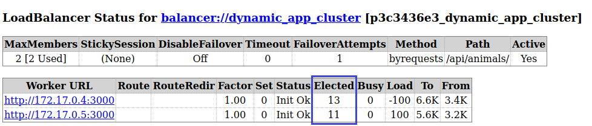

It should be noted that the `balance-manager` page must be refreshed each time for the changes to be visible. This behavior of the counter then allows us to check that the _Round-robin_ is working correctly. 


**2. Sticky sessions**

To test the _sticky sessions_, we modify the site page (_index.html_) of the 2nd image of the static server (modification of the title) in order to differentiate the 2 images of the static server. 

We then access the page in the browser at the address http://demo.res.ch:8080/, we arrive on this page :  

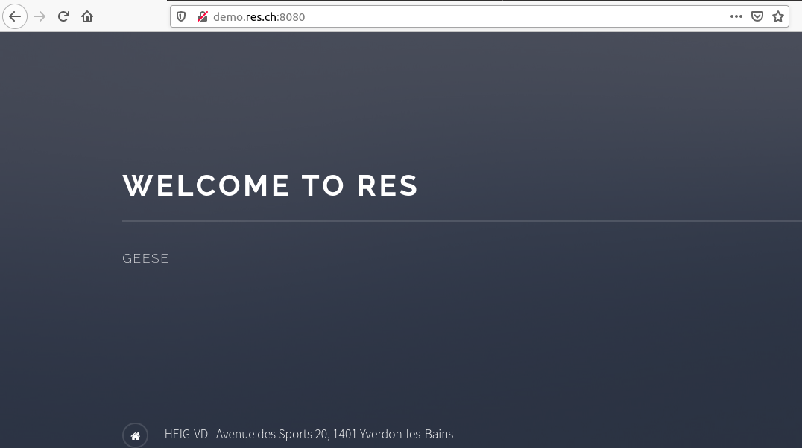


We will now delete the cookies from our browser and reload the page. We can therefore see that we are this time on the page of the other static server. 

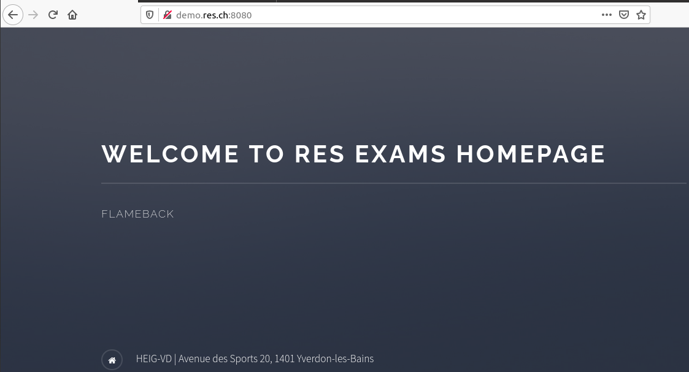


Using the cookie, we communicated with the same static server even during a page refresh. But as soon as the cookie is deleted, the client is no longer "*linked*" to the first server and can therefore access the second. 

A final check consists of going to the _load balancing_ management page at the address http://demo.res.ch:8080/balancer-manager. 

We see in the field `StickySession` contains the parameter` ROUTEID` defined previously in our `config-template.php` file. Our 2 static sites also have their respective route in the `Route` field.

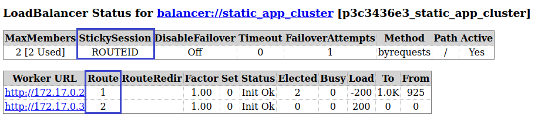


---

### Extra step: Management UI

#### Purpose

Now we want to be able to visualize our images and docker containers in a user-friendly graphical interface where we can perform different operations(list containers, start/stop containers, etc.) .

**Please note:** For this step we decided not to make a web app, which would have taken a long time, we chose to use portainer. Portainer is an open-source management UI for Docker that allows you to manage containers, images, networks, and volumes from the web-based Portainer dashboard.

#### Implementation

To proceed with the installation of portainer, I have already prepared a bash file **run-portainer.sh** (inside the folder `portainer`) for you containing:

```
docker volume create portainer_data

docker run -d -p 8000:8000 -p 9000:9000 --name=portainer --restart=always -v /var/run/docker.sock:/var/run/docker.sock -v portainer_data:/data portainer/portainer
```

- `docker volume create portainer_data` : This command creates a volume on your disk that Portainer will use to store your configuration. Without this volume, the configuration data will be stored in the container and lost each time the container is restarted.
- The next command will allow you to download and run the Portainer image and start up the Portainer Container

#### Tests

Once the installation procedure is complete, we can connect to the address [localhost:9000](http://localhost:9000/)

[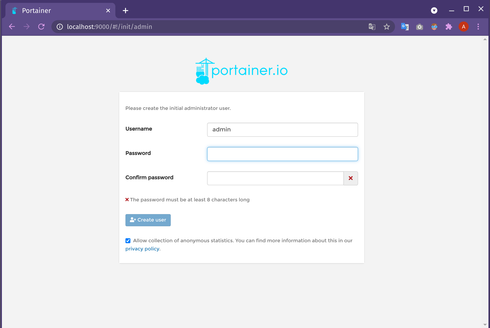](https://github.com/Cantondy/Teaching-HEIGVD-RES-2021-Labo-HTTPInfra/blob/extra-managementUI/media/managementUI_1.png)

You will be displayed this interface where you have to register by entering a **username** and **password**(Don't forget them, they will be required at the next access to portainer).

We will configure Portainer to connect to the local Docker environment.

[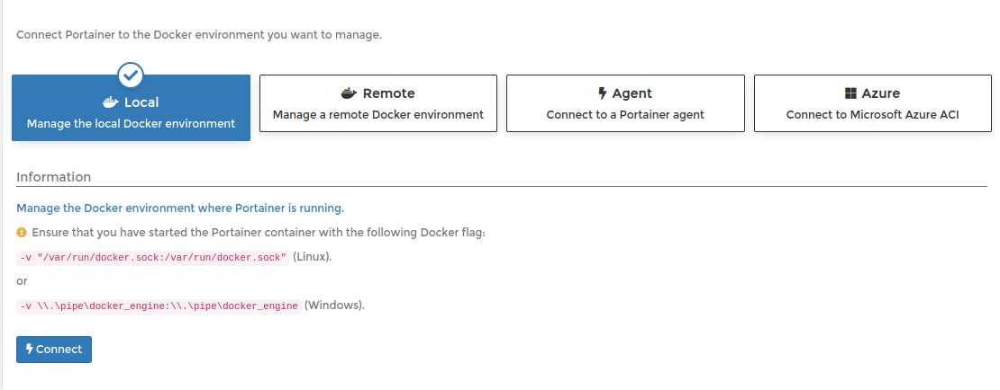](https://github.com/Cantondy/Teaching-HEIGVD-RES-2021-Labo-HTTPInfra/blob/extra-managementUI/media/managementUI_2.PNG)

Choose the 'Local' environment and click 'Connect' button.

We would be transported to the Portainer homepage, where we can find your local docker server, you can click on "local" to see your dashboard.

[](https://github.com/Cantondy/Teaching-HEIGVD-RES-2021-Labo-HTTPInfra/blob/extra-managementUI/media/managementUI_3.PNG)

Once in the dashboard, there will be different options, such as managing containers, images, volumes, networks and much more.

[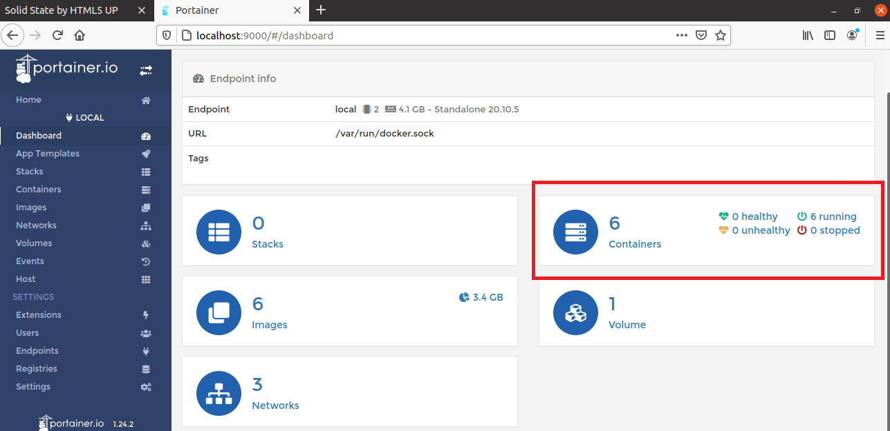](https://github.com/Cantondy/Teaching-HEIGVD-RES-2021-Labo-HTTPInfra/blob/extra-managementUI/media/managementUI_4.PNG)

For container management just click on "container" to get the list of containers

[](https://github.com/Cantondy/Teaching-HEIGVD-RES-2021-Labo-HTTPInfra/blob/extra-managementUI/media/managementUI_5.PNG)

In this web interface we can see important information about the container, such as name, state, IP addresses, creation date, port addresses etc.., in addition we would have available most of the basic functions of docker such as, run, start, stop, kill, exec and much more.

**Please note**: Portainer contains many other features that were not covered during this use case, the demo is for container management purposes only. Here a more detailed [documentation](https://documentation.portainer.io/) about portainer.
