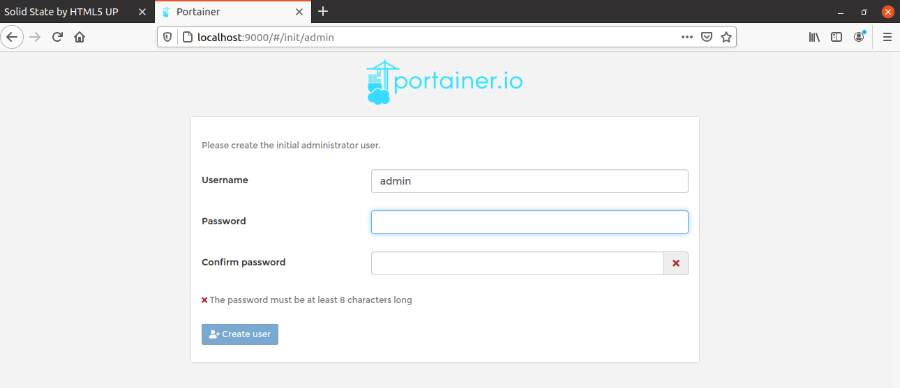

### Management UI

#### Purpose

Now we want to be able to visualize our images and docker containers in a user-friendly graphical interface where we can perform different operations(list containers, start/stop containers, etc.) .

**Please note: **For this step we decided not to make a web app, which would have taken a long time, we chose to use portainer. Portainer is an open-source management UI for Docker that  allows you to manage containers, images, networks, and volumes from the web-based Portainer dashboard.

#### Implementation

To proceed with the installation of portainer, I have already prepared a bash file **run-portainer.sh** (inside the folder `portainer`) for you containing:

```sh
docker volume create portainer_data

docker run -d -p 8000:8000 -p 9000:9000 --name=portainer --restart=always -v /var/run/docker.sock:/var/run/docker.sock -v portainer_data:/data portainer/portainer-ce

```

* `docker volume create portainer_data` : This command creates a volume on your disk that  Portainer will use to store your configuration. Without this volume, the configuration data will be stored in the container and lost each time the container is restarted.

* The next command will allow you to download and run the Portainer image and start up the Portainer Container

#### Tests

Once the installation procedure is complete, we can connect to the address [localhost:9000](http://localhost:9000/)



You will be displayed this interface where you have to register by entering a **username** and **password**.

